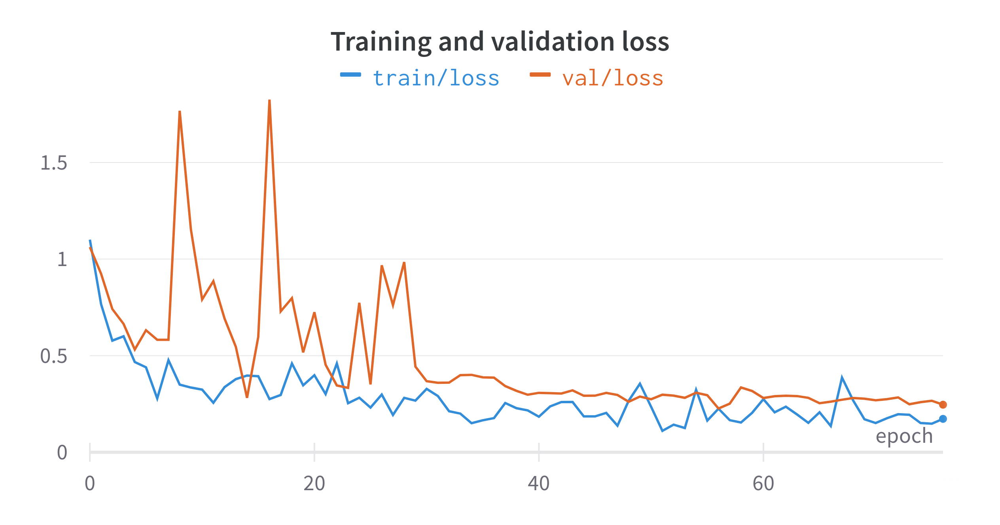
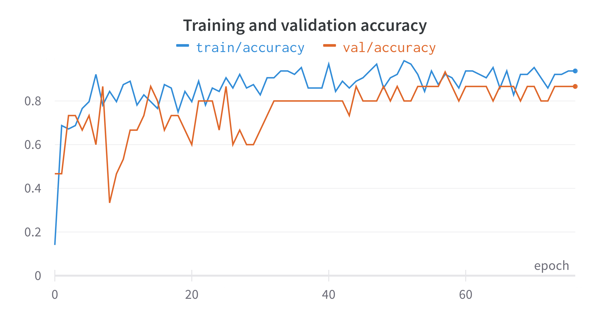
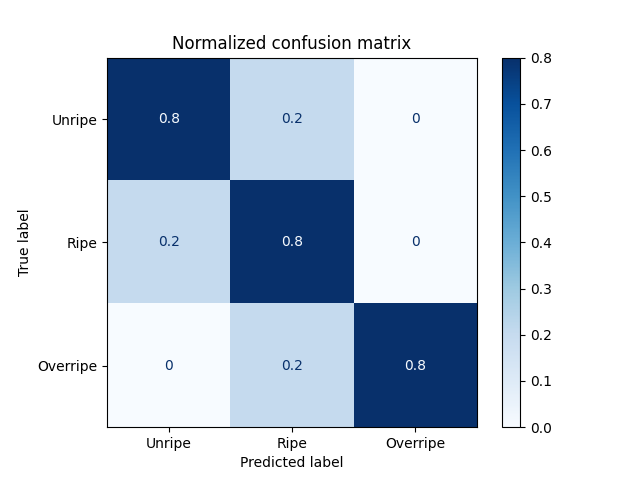
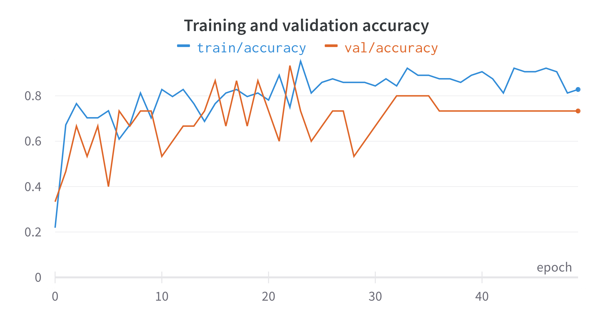
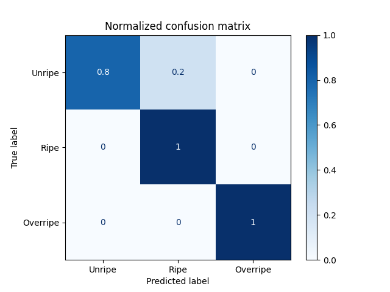

# Measuring the Ripeness of Fruit with Hyperspectral Imaging and Deep Learning

    Version 2:
        - The training is now more stable
        - Added new hyperspectral recordings
        - Added HyveConv++ model

    Version 1 is still avaiable on branch 'paper_version' 

Here you can find the dataset and the official implementation of the HS-CNN network with an optimized training pipeline.

## Data set (v2)
The dataset is [here](https://cogsys.cs.uni-tuebingen.de/webprojects/Deepths-Fruits-2023-Datasets/) or as [torrent](https://cogsys.cs.uni-tuebingen.de/webprojects/Deepths-Fruits-2023-Datasets/Deepths-Fruits-2023-Datasets.torrent) available. 
It contains recordings of:
 - Avocados
 - Kiwis
 - Persimmons
 - Papayas
 - Mango

Three hyperspectral cameras were use:
 - Specim FX 10
 - INNO-SPEC Redeye 1.7
 - Corning microHSI 410 Vis-NIR Hyperspectral Sensor

The data set covers four measurement series. Labels are provided as destructive measurements (fruit flesh firmness, sugar content and overall ripeness)

### Requirements
 - Python 3.10
 - PyTorch 1.11.0
and the packages defined in the requirements file (```pip3 install -r requirements.txt```)
 - Download the data set to a local folder

## How to train
If all packages are installed and the data set was downloaded, the training can start.
This will train the HS-CNN model on the ripeness classification of avocados:

    PYTHONPATH=$PYTHONPATH:. python3 classification/train.py --data_path /folder/of/downloaded/dataset/ --model deephs_net --fruit avocado --classification_type ripeness --seed 23312323

<br>
<br>
<br>
**Figure 1** - Training of HS-CNN:
  
And this will train HS-CNN + HyveConv++ on the same classification task:

    PYTHONPATH=$PYTHONPATH:. python3 classification/train.py --data_path /folder/of/downloaded/dataset/ --model hyve --fruit avocado --classification_type ripeness --seed 23312323

<br>
<br>
<br>
**Figure 2** - Training of HS-CNN + HyveConv++:

```PYTHONPATH=$PYTHONPATH:. python3 classification/train.py --help``` provides helpful information regarding the parameters. 
For more information about the training framework PyTorch-Lightning, we refer to the official documentation (https://pytorch-lightning.readthedocs.io/en/latest/).

            
## Citation
The paper was presented on IJCNN 2021.
```
@inproceedings{Varga2021,
abstract = {We present a system to measure the ripeness of fruit with a hyperspectral camera and a suitable deep neural network architecture. This architecture did outperform competitive baseline models on the prediction of the ripeness state of fruit. For this, we recorded a data set of ripening avocados and kiwis, which we make public. We also describe the process of data collection in a manner that the adaption for other fruit is easy. The trained network is validated empirically, and we investigate the trained features. Furthermore, a technique is introduced to visualize the ripening process.},
archivePrefix = {arXiv},
arxivId = {2104.09808},
author = {Varga, Leon Amadeus and Makowski, Jan and Zell, Andreas},
booktitle = {2021 International Joint Conference on Neural Networks (IJCNN)},
doi = {10.1109/IJCNN52387.2021.9533728},
eprint = {2104.09808},
isbn = {978-1-6654-3900-8},
keywords = {Index Terms-hyperspectral,convolutional neu-ral network,deep learning,ripening fruit},
month = {jul},
pages = {1--8},
publisher = {IEEE},
title = {{Measuring the Ripeness of Fruit with Hyperspectral Imaging and Deep Learning}},
url = {https://arxiv.org/abs/2104.09808v1 http://arxiv.org/abs/2104.09808 https://ieeexplore.ieee.org/document/9533728/},
year = {2021}
}

```
For HyveConv++ please check: https://github.com/cogsys-tuebingen/hyve_conv


